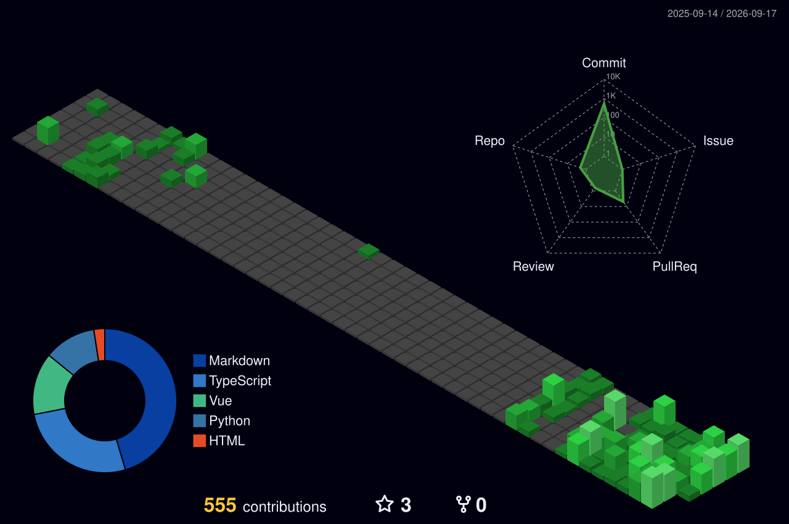

# Hi guys! It's me, Aditya!

<!-- The banner is distributed under CC-BY-SA-4.0 -->

<!--Readme Typing SVG by Jonah Lawrence (DenverCoder1): https://github.com/denvercoder1/readme-typing-svg -->

### My Skills

<!-- Skill Icons by syvixor: https://github.com/syvixor/skills-icons -->

 
### My Stats

<!-- GitHub Profile Views Counter by Anton Komarev (antonkomarev): https://github.com/antonkomarev/github-profile-views-counter -->
  <!-- shields by Shields.io (badges): https://github.com/badges/shields -->   

<!-- GitHub Immortality by IceEnd: https://github.com/IceEnd/github-immortality -->

<!-- GitHub Readme Stats Action by stats-organization: https://github.com/stats-organization/github-readme-stats-action -->

<!-- GitHub Contribution Card by Davide Ladisa (FrancoStino): https://github.com/FrancoStino/github-contribution-card -->

<!-- GitHub Readme Activity Graph Action by Mauro de Souza (maurodesouza): https://github.com/maurodesouza/github-readme-activity-graph-action -->

<!-- GitHub Profile 3D Contrib by SATO Yoshiyuki (yoshi389111): https://github.com/yoshi389111/github-profile-3d-contrib -->

 
<!-- snk by Arthur (Platane): https://github.com/Platane/snk -->

<!-- GitHub Profile Trophy by Devom Brahmbhatt (DevomB): https://github.com/DevomB/Github-Trophies -->

<!-- Github Readme Streak Stats by Jonah Lawrence (DenverCoder1): https://github.com/denvercoder1/github-readme-streak-stats -->

<!-- GitHub Profile Summary Cards by Casper (vn7n24fzkq): https://github.com/vn7n24fzkq/github-profile-summary-cards -->

 
 
 
 
<!-- GitAnimals by git-goods: https://github.com/git-goods/gitanimals -->

 

 

 

